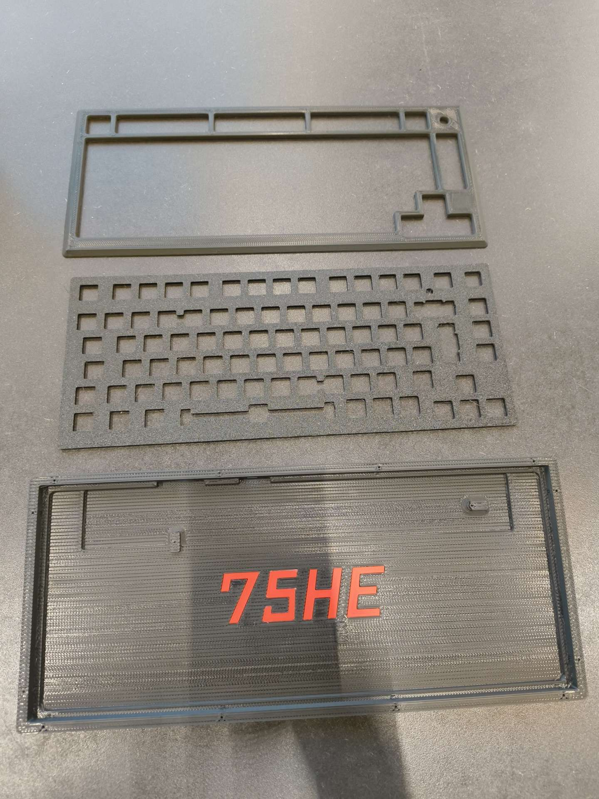
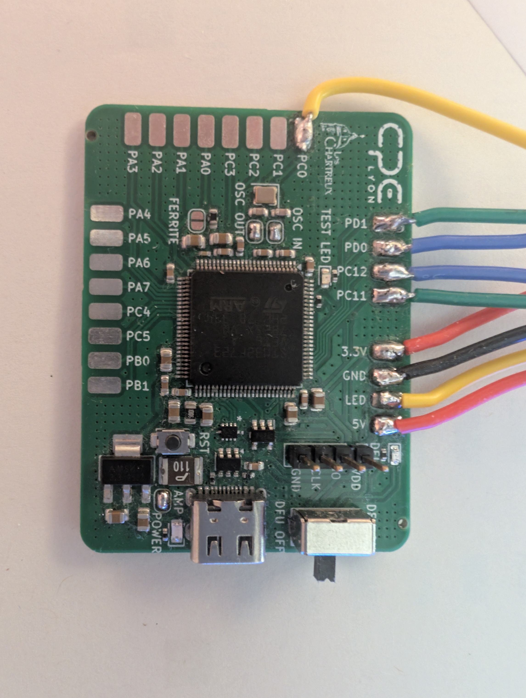
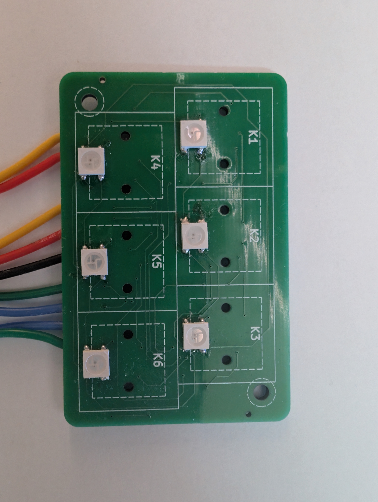
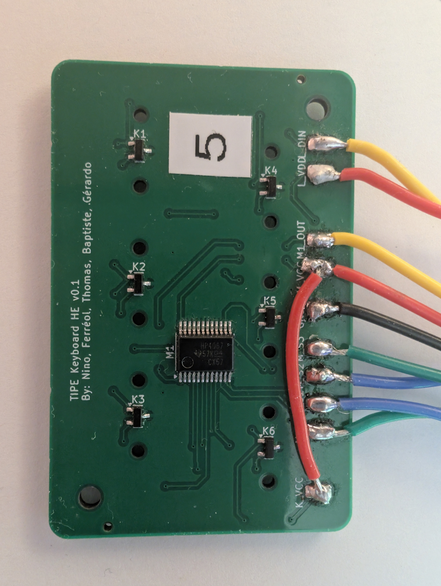
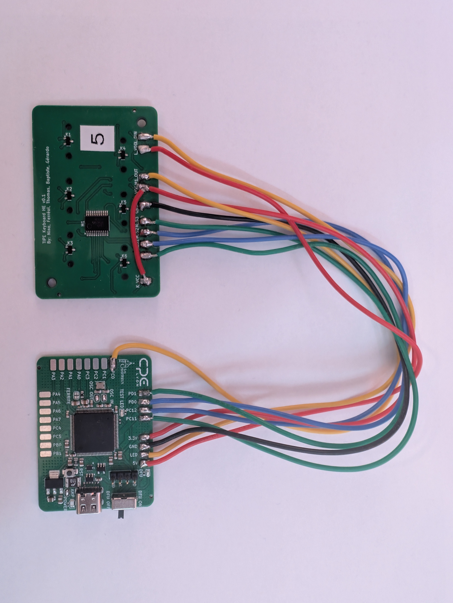
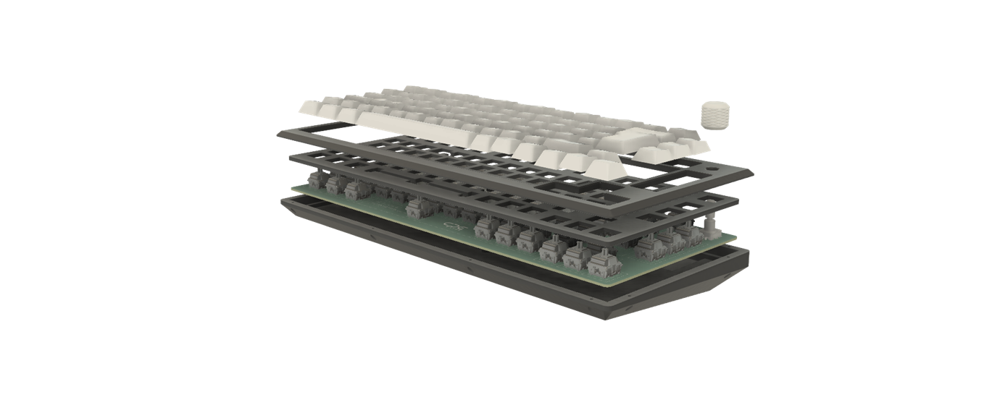
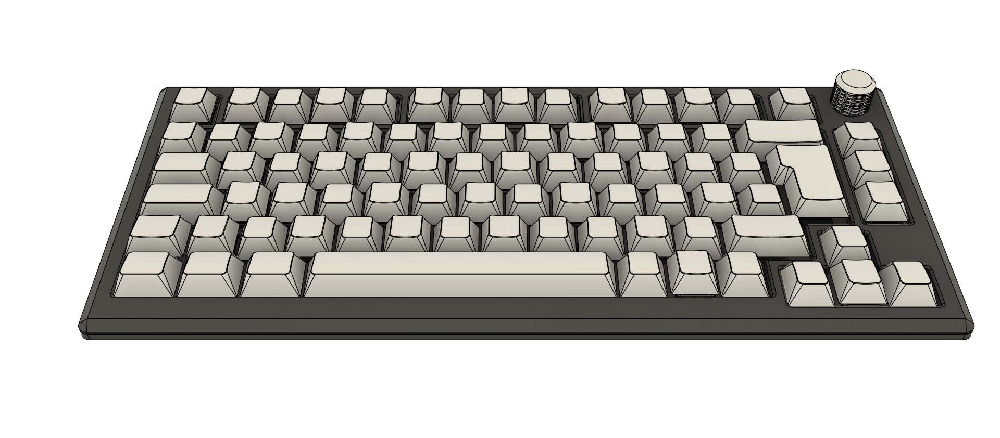
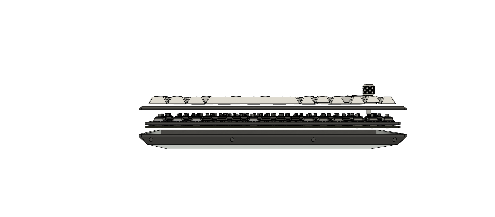
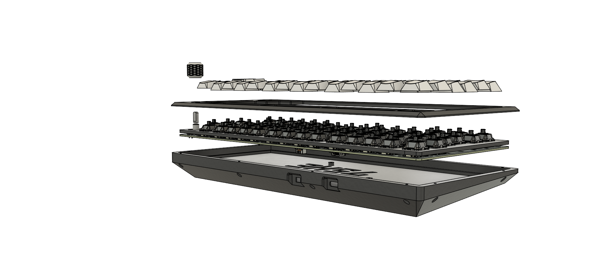

# KBHE

KBHE is a Hall effect keyboard project packaged as one product monorepo: STM32 firmware, the Tauri desktop configurator, the 75HE KiCad PCB, and the mechanical 3D files live together with the documentation needed to build and maintain them.

**CAD: full assembly (v13)**


**Assembled 75% keyboard (pudding caps, RGB)**


## TIPE presentation (synoptic, report, part drawing)

Sourced materials for the TIPE deliverables: synoptic, English summary, part naming drawing, a short workbench video clip.

- [tipe-synoptique.pdf](assets/presentation/tipe-synoptique.pdf) — project synoptic
- [tipe-english-paper.pdf](assets/presentation/tipe-english-paper.pdf) — short English paper
- [tipe-drawing-part-labels.pdf](assets/presentation/tipe-drawing-part-labels.pdf) — drawing, part / reference labels
- [tipe-bench-clip.mp4](assets/presentation/tipe-bench-clip.mp4) — short bench / lab clip

## 75HE v1.0 main PCB (photographs)

| Top: switches + per-key RGB | Bottom: solder side (hand) |
| --- | --- |
|  |  |

## Final 75HE PCB (full board, KiCad 3D)

Renders of the main production board, exported from the KiCad project in `hardware/pcb/75he/Assets/`.

| Top (component side) | Bottom (solder side) |
| --- | --- |
|  |  |

## Prototyping: fabrication, plates, 3D prints

| Metal plate and 3D-printed top bezel | FDM: case half on the build plate | Printed set: top bezel, switch plate, bottom (75HE embossed) |
| --- | --- | --- |
|  |  |  |

## STM32 breakout, hall prototypes, and TIPE v0.1 bench setup

| STM32 test PCB: STLink + DFU silk | STM32: USB-C, DFU area (top) | STM32: bench, USB-C, DFU + flying wires |
| --- | --- | --- |
|  |  |  |

| 6-key Hall bench PCB | **TIPE Keyboard HE** v0.1 (CD74HC4067) — bench wiring | v0.1 Hall analog board **cabled to** STM32 breakout |
| --- | --- | --- |
|  |  |  |

## TIPE research bench and lab (wide stills)

| At the bench (1) | At the bench (2) | At the bench (3) |
| --- | --- | --- |
|  |  |  |


## First-time board programming (STM32CubeProgrammer, DFU)

The **first** time you program a **blank** board you need a Release build, the physical **DFU / FS** switch, **ROM DFU** over USB, and **STM32CubeProgrammer** to erase the chip and program the custom bootloader and application image. Ongoing updates use the Tauri app or the RAW HID tools instead.

**Step-by-step (French):** [docs/firmware/overview.md](docs/firmware/overview.md) — start at the section *Flash initial d'une carte neuve (bootloader custom)* (build → DFU connect → full erase → flash `kbhe_bootloader.hex` at `0x08000000` and `kbhe.hex` at `0x08010000` → normal boot → optional `raw_hid.py --flash` to finalize the updater). Related notes: [docs/firmware/raw_hid_usage.md](docs/firmware/raw_hid_usage.md), [docs/README.md](docs/README.md).

## Repository Layout

- `firmware/` - STM32F723 firmware, custom RAW HID bootloader, CMake toolchain and CubeMX-generated support files.
- `apps/configurator/` - Tauri desktop configurator for key settings, calibration, lighting, firmware flashing and app updates.
- `hardware/pcb/75he/` - KiCad PCB project with project-local libraries, 3D models, documentation and legacy PCB revisions.
- `hardware/3d/` - mechanical source files and exported models. Large mechanical formats are tracked with Git LFS.
- `assets/presentation/` - TIPE PDFs (synoptic, English paper, part-label drawing) and a short workbench **.mp4** clip.
- `assets/cad/75he-mechanical/` - mechanical **CAD** stills: full assembly, shaded exploded stack, isometric, part-exploded **top / bottom / three-quarter** views.
- `assets/photos/` - real photos, grouped by topic: `product/`, `pcb-75he/`, `pcb-mcu-breakout/`, `prototypes/`, `fdm-fabrication/`, `tipe-lab/`, `app/`. No camera timestamps in file names: names describe **content**.
- `tools/`, `docs/`, `layouts/`, `data/` - as before.

## Firmware

```powershell
cmake --preset Release
cmake --build --preset Release
```

Artifacts are written to `build/Release/`. The CI also builds `Release-apponly` for app-only firmware packages. For a **first** flash of blank hardware, follow [docs/firmware/overview.md](docs/firmware/overview.md) (DFU, STM32CubeProgrammer) before relying on the app’s HID updater.

## Configurator

The desktop app handles keymap, performance, Gamepad, calibration, the rotary encoder, lighting, and firmware over RAW HID. Example: **Keymap** for a 75% **ISO-FR** layout in dark UI.


```powershell
cd apps/configurator
bun install
bun run build
cd src-tauri
cargo check --locked
```

For a local installer build:

```powershell
cd apps/configurator
bun tauri build
```

## Releases

The monorepo uses explicit tag prefixes so the desktop app can distinguish app installers from firmware binaries:

- `firmware-vX.Y.Z` builds firmware artifacts and publishes them in a GitHub Release.
- `app-vX.Y.Z` builds the Tauri installer and publishes it in a GitHub Release.

The configurator checks these release streams from inside the app. App updates download and launch the published installer. Firmware updates download the latest firmware binary and flash it through the existing RAW HID update path.

## Working With 3D Assets

Install Git LFS before cloning or pushing mechanical changes:

```powershell
git lfs install
```

The current mechanical files are under `hardware/3d/current/`; older exports are kept under `hardware/3d/legacy/`.

## Mechanical CAD: exploded part views and overviews

Files live in `assets/cad/75he-mechanical/`. The **“parts”** set are consistent orientations of the decomposed case + plate; **“legacy”** older exports use different camera framing.

| Exploded: parts from top | Exploded: parts, bottom / rear | Exploded: three-quarter (right) |
| --- | --- | --- |
|  |  |  |

| All layers **stacked** (shade) | Full keyboard **3/4** (no case explode) | **Side elevation** (older export) | **Rear-left** isometric (older export) |
| --- | --- | --- | --- |
|  |  |  |  |

### Legacy KiCad prototypes (3D exports from the repo)

| 6-key Hall | MCU v1 | MCU v2 |
| --- | --- | --- |
|  |  |  |

## Current limitations - TODOs
- For transparent keycaps the space bar lacks leds on the sides
- For the enter key the led is colliding with the stabilizer which needs to be cut
- DFU switch should be hidden
- Wireless version
- Underglow
- Reversed mounted LEDs (single side pcb)
- Mountiing holes placements may need to be adjusted
- Try lowering pcb layer count without sacrificing noise performance
- Add support for libhmk
- Final touches on 3D models: adjust tolerances, raise the top case, adjust USB and switch hole position
