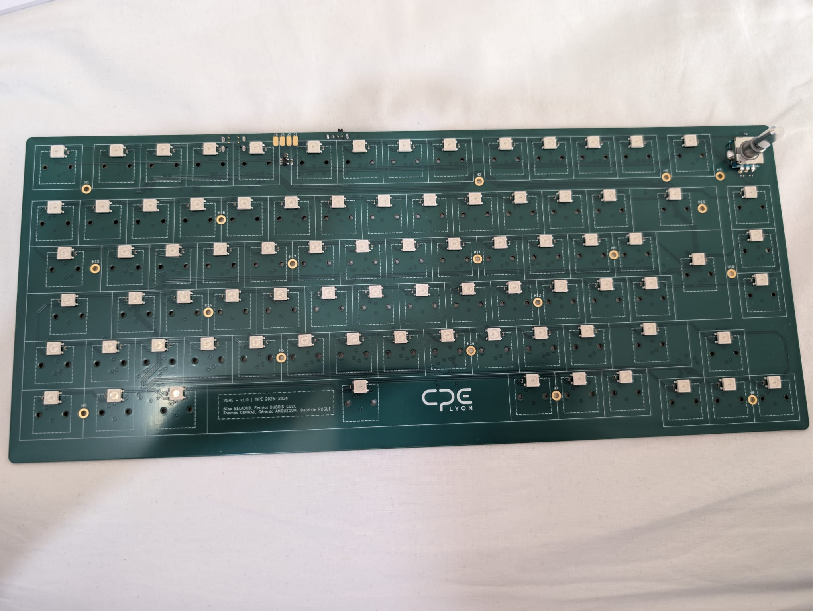
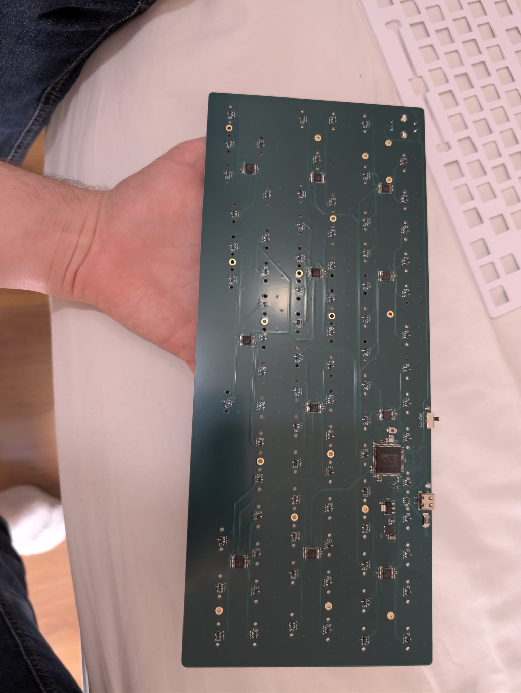
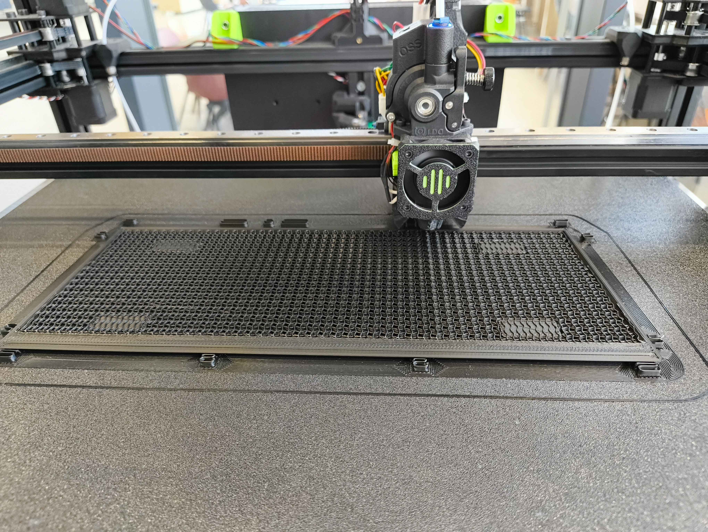
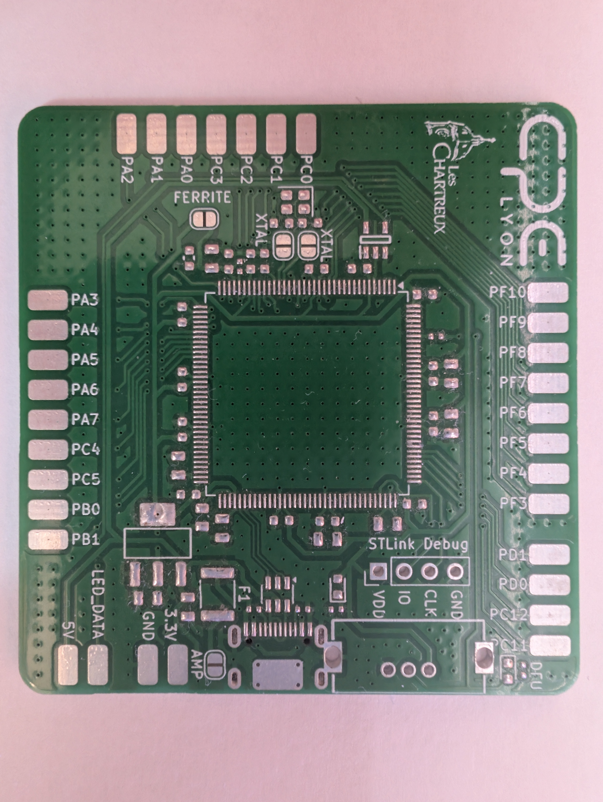
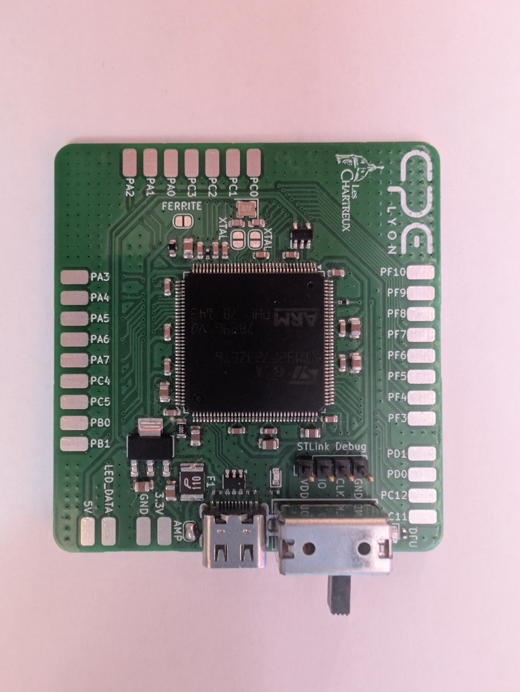
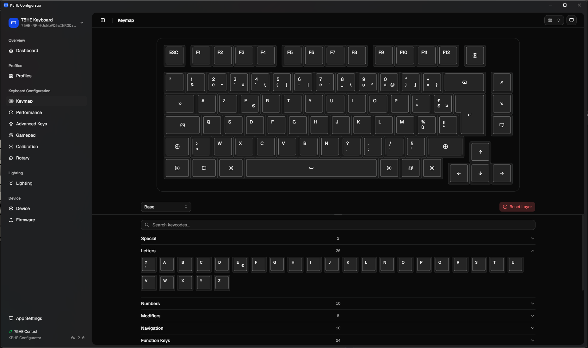
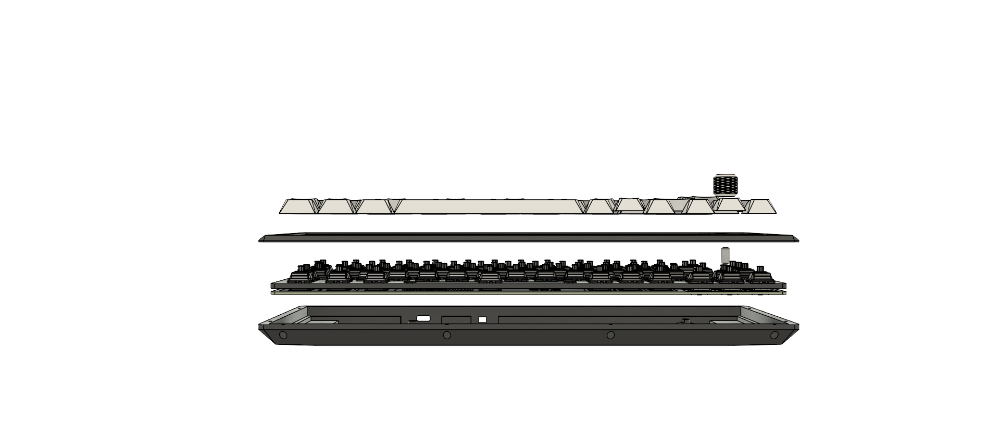

# KBHE

KBHE is a Hall effect keyboard project packaged as one product monorepo: STM32 firmware, the Tauri desktop configurator, the 75HE KiCad PCB, and the mechanical 3D files live together with the documentation needed to build and maintain them.

**CAD full assembly (v13)**


**Photo: assembled 75% (RGB)**


## 75HE v1.0 PCB (real photos)

| Top (soldered components) | Bottom (solder side, hand-held) |
| --- | --- |
|  |  |

## Final 75HE PCB (full board, KiCad 3D)

Renders of the main production board (component side and solder side), as exported from the KiCad project in `hardware/pcb/75he/Assets/`.

| Top (component side) | Bottom (solder side) |
| --- | --- |
|  |  |

## Build and lab photos

Real hardware alongside CAD: plate, printed case, 3D print, MCU breakout, 6-key hall test board, and the TIPE HE v0.1 multiplexer board.

| Plate + 3D-printed case | FDM print in progress on the build plate |
| --- | --- |
|  |  |

| MCU test PCB (STLink + DFU) | 6-key hall test board (wired) |
| --- | --- |
|  |  |

| MCU test PCB, USB/DFU (top) | MCU test PCB, DFU + wire harness |
| --- | --- |
|  |  |

**« TIPE Keyboard HE v0.1 »** (CD74HC4067 + six hall inputs, wired for bench tests)


## TIPE workshop, 14 Apr 2026 (session photos)

| Atelier (1) | Atelier (2) | Atelier (3) |
| --- | --- | --- |
|  |  |  |

## First-time board programming (STM32CubeProgrammer, DFU)

The **first** time you program a **blank** board you need a Release build, the physical **DFU / FS** switch, **ROM DFU** over USB, and **STM32CubeProgrammer** to erase the chip and program the custom bootloader and application image. Ongoing updates use the Tauri app or the RAW HID tools instead.

**Step-by-step (French):** [docs/firmware/overview.md](docs/firmware/overview.md) — start at the section *Flash initial d'une carte neuve (bootloader custom)* (build → DFU connect → full erase → flash `kbhe_bootloader.hex` at `0x08000000` and `kbhe.hex` at `0x08010000` → normal boot → optional `raw_hid.py --flash` to finalize the updater). Related notes: [docs/firmware/raw_hid_usage.md](docs/firmware/raw_hid_usage.md), [docs/README.md](docs/README.md).

## Repository Layout

- `firmware/` - STM32F723 firmware, custom RAW HID bootloader, CMake toolchain and CubeMX-generated support files.
- `apps/configurator/` - Tauri desktop configurator for key settings, calibration, lighting, firmware flashing and app updates.
- `hardware/pcb/75he/` - KiCad PCB project with project-local libraries, 3D models, documentation and legacy PCB revisions.
- `hardware/3d/` - mechanical source files and exported models. Large mechanical formats are tracked with Git LFS.
- `assets/` - documentation images: `assets/photos/` (sorted by kind: `keyboard-pcb/`, `mcu-dev-board/`, `workshop-2026-04-14/`, etc.), and `assets/cad/75he-exploded/` for CAD renders. PDFs and other project documents stay in `assets/`.
- `tools/` - host-side Python tools, firmware utilities, analysis scripts and integrations.
- `docs/` - shared documentation and release notes.
- `layouts/` and `data/` - keyboard layout data and firmware support data.

## Firmware

```powershell
cmake --preset Release
cmake --build --preset Release
```

Artifacts are written to `build/Release/`. The CI also builds `Release-apponly` for app-only firmware packages. For a **first** flash of blank hardware, follow [docs/firmware/overview.md](docs/firmware/overview.md) (DFU, STM32CubeProgrammer) before relying on the app’s HID updater.

## Configurator

The desktop app handles keymap, performance, Gamepad, calibration, the rotary encoder, lighting, and firmware over RAW HID. Example: **Keymap** tab for a 75% ISO-FR layout.



```powershell
cd apps/configurator
bun install
bun run build
cd src-tauri
cargo check --locked
```

For a local installer build:

```powershell
cd apps/configurator
bun tauri build
```

## Releases

The monorepo uses explicit tag prefixes so the desktop app can distinguish app installers from firmware binaries:

- `firmware-vX.Y.Z` builds firmware artifacts and publishes them in a GitHub Release.
- `app-vX.Y.Z` builds the Tauri installer and publishes it in a GitHub Release.

The configurator checks these release streams from inside the app. App updates download and launch the published installer. Firmware updates download the latest firmware binary and flash it through the existing RAW HID update path.

## Working With 3D Assets

Install Git LFS before cloning or pushing mechanical changes:

```powershell
git lfs install
```

The current mechanical files are under `hardware/3d/current/`; older exports are kept under `hardware/3d/legacy/`.

## PCB and CAD (exploded views)

The KiCad project is self-contained under `hardware/pcb/75he/`: footprints, symbols, 3D models and useful component documentation are stored inside the project tree. **Illustration renders** and **photos** of the run live under `assets/` (see `assets/photos` and `assets/cad/75he-exploded`). Legacy KiCad projects are under `hardware/pcb/75he/Legacy/`.

| Exploded (face) | Exploded (back) | 3/4 view |
| --- | --- | --- |
|  |  |  |

### Legacy KiCad prototypes (3D render exports)

| 6-key hall | MCU board v1 | MCU board v2 |
| --- | --- | --- |
|  |  |  |

## Current limitations - TODOs
- For transparen keycaps the space bar lacks leds on the sides
- For the enter key the led is colliding with the stabilizer which needs to be cut
- DFU switch should be hidden
- Wireless version
- Underglow
- Reversed mounted LEDs (single side pcb)
- Mountiing holes placements may need to be adjusted
- Try lowering pcb layer count without sacrificing noise performance
- Add support for libhmk
- Final touches on 3D models: adjust tolerances, raise the top case
