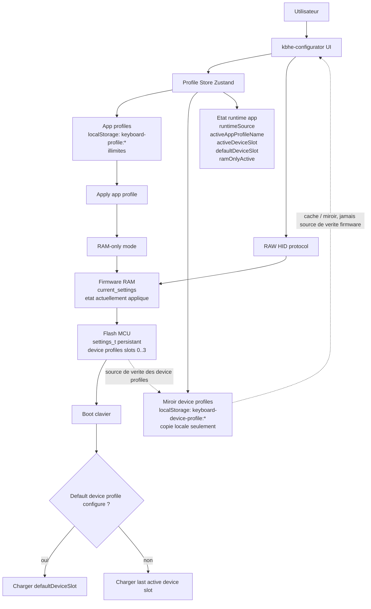
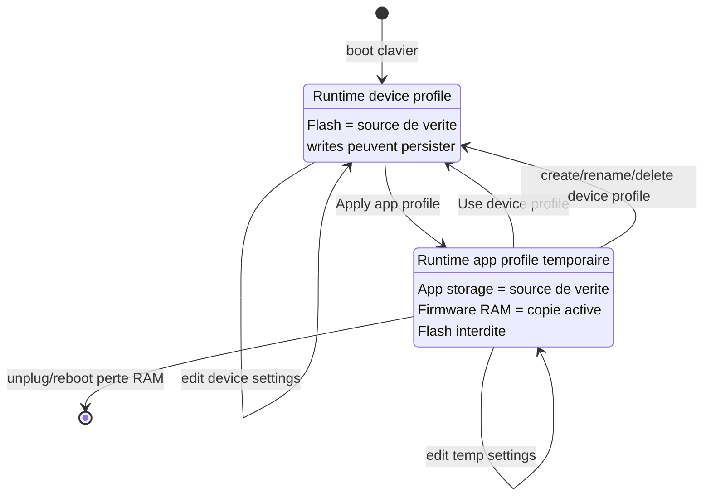
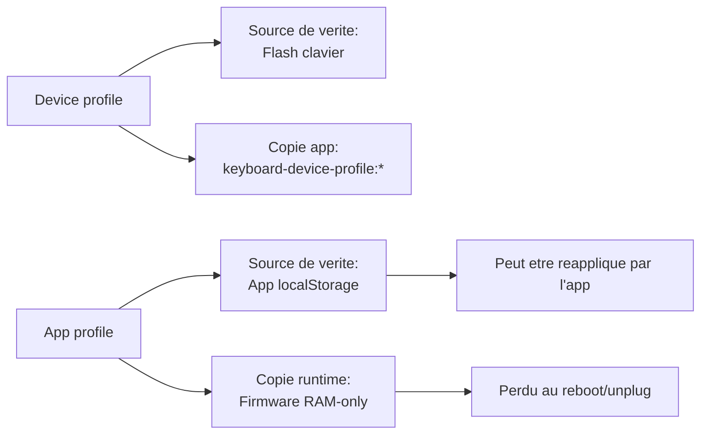
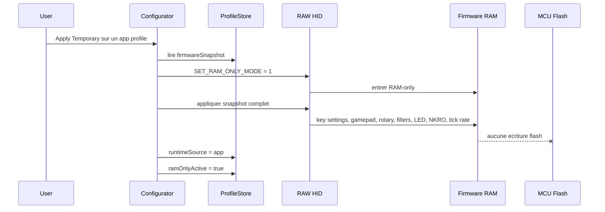
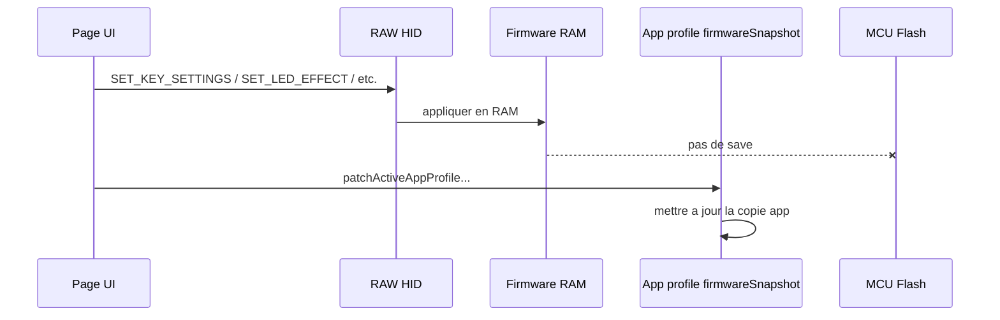
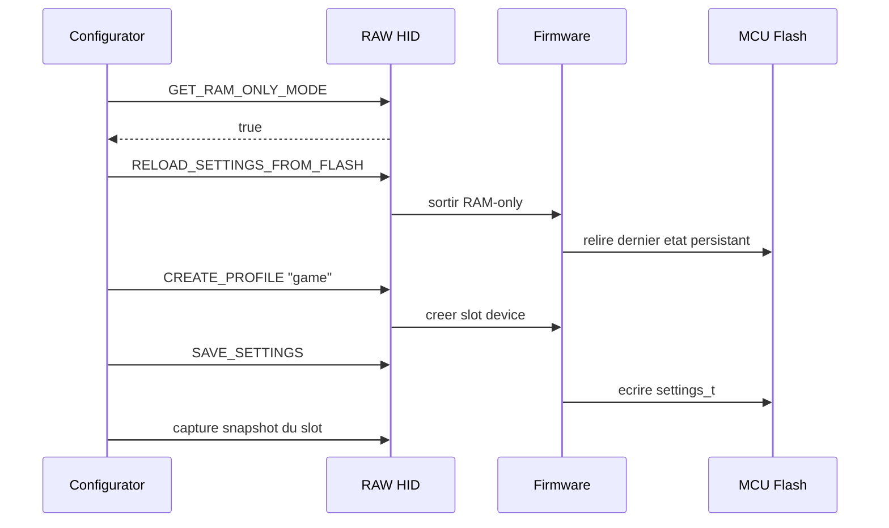
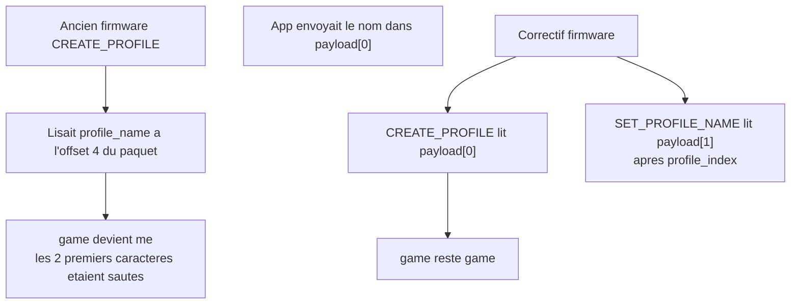
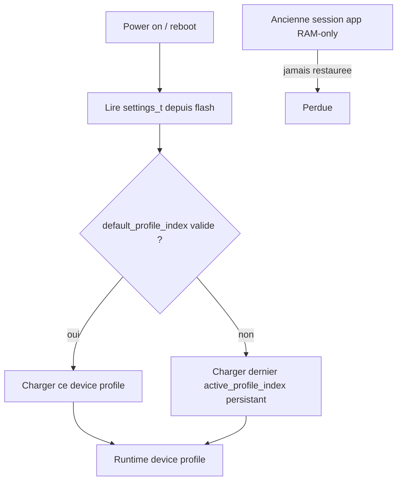

Oui. Voici le modèle complet de la feature, en séparant bien **stockage**, **runtime**, **sync**, **boot** et **sécurité RAM-only**.

**Modèle mental**

Il y a 3 concepts distincts:

1. **Device profile**
Stocké dans la flash du clavier. Limité aux slots MCU, actuellement `0..3`. C’est persistant, bootable, et le clavier est la source de vérité.

2. **App profile**
Stocké uniquement dans l’app, dans `localStorage` via `keyboard-profile:*`. Illimité. Le clavier ne peut jamais booter directement dessus.

3. **Temporary RAM session**
Quand on applique un app profile au clavier, l’app envoie son snapshot au firmware en RAM-only. Le clavier utilise ces réglages en RAM, mais ne les écrit jamais en flash.

**Règles de vérité**

Pour un **device profile**, l’app ne doit pas inventer l’état sauvegardé: elle lit/capture le clavier et garde un miroir local.

Pour un **app profile**, le clavier ne dicte pas le stockage: l’app garde le snapshot, puis le pousse au clavier temporairement.

**Flux: appliquer un app profile temporaire**

En RAM-only, les lectures depuis l’app doivent représenter l’état effectif en RAM. Les écritures modifient:
- le firmware RAM,
- le snapshot app local,
- mais jamais la flash.

**Flux: éditer pendant une session temporaire**

C’est le rôle de `profile-snapshot-store.ts`: chaque page qui écrit dans le clavier patch aussi le snapshot local si `runtimeSource === "app"` et `ramOnlyActive === true`.

**Flux: créer un device profile depuis RAM-only**

Et côté firmware, une sécurité supplémentaire existe maintenant: si un host tente `CREATE_PROFILE`, `DELETE_PROFILE`, `SET_PROFILE_NAME`, `SET_DEFAULT_PROFILE`, etc. en RAM-only, le firmware répond erreur.

**Bug `"game"` devient `"me"`**

Le bug était donc bien firmware. L’app envoyait le payload selon la logique attendue, mais le handler firmware le parsait comme une struct complète de réponse.

**Boot behavior**

Un app profile ne peut pas être un boot default, car il n’existe pas dans la flash du clavier.

**Résumé des garanties**

- Les app profiles sont illimités et app-only.
- Les device profiles occupent un slot MCU.
- Une session app temporaire ne pollue jamais la flash.
- Une opération device persistante sort toujours du RAM-only avant d’agir.
- Le firmware refuse maintenant les opérations device persistantes si RAM-only est encore actif.
- Le boot ne restaure que des device profiles.
- Le miroir app des device profiles est une copie locale, pas la source de vérité.